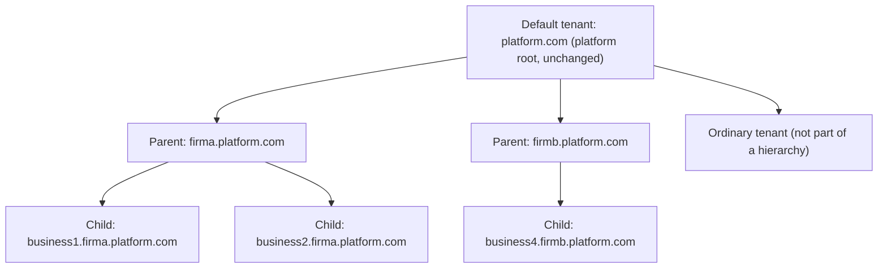

# Tenant Hierarchy — Feasibility, Security Review and Plan

> **Status: proposal, decisions recorded. Nothing is built.** Written against Orchard Core `main` at `988c29a406` (2026-10-02, 4.0 preview) and CrestApps `main` at `e782f7151`. All Orchard Core paths below are relative to the Orchard Core repository root. Facts marked **(verify)** come from reading code only and need a spike or test before we depend on them. The decisions on the open questions are in [section 11](#11-decisions).

## 1. Verdict

**The module is realistic, and it does not need a fork of Orchard Core.** Orchard Core already has everything we need at the host level. A non-Default tenant can resolve `IShellHost`, `IShellSettingsManager`, `IShellRemovalManager` and `ISetupService`, because these are host singletons copied into every tenant container. Only the *Tenants module* (its UI, API and workflow tasks) refuses to run outside Default. So a parent tenant can create, set up, disable, enable and remove tenants through our own code.

**We do not need "more than one Default tenant".** We need *delegated tenant management* plus *cross-tenant sign-in*. The Default tenant stays as it is. It is the platform root, and it still sees and controls every tenant through the normal Tenants admin.

**For delegated access we recommend a brokered, in-process sign-in, not the Orchard Core OpenID modules.** The parent issues a one-time code. The child redeems it through an in-process broker that knows which tenant is calling. The child then creates (or reuses) a local *linked user* that belongs to the parent user, so all content and audit records show the real person. Section 9 explains why the stock OpenID server and client are not safe enough for this as they are.

**Five rules carry the security of the whole design:**

1. **Every tenant gets its own host name**, never a path prefix. A firm is `{firm}.platform.com` and its businesses are `{business}.{firm}.platform.com`. Tenants on one host share one browser origin, and a cookie `Path` is not a security boundary. With path prefixes, a child admin's script could read parent and sibling pages in a firm user's browser.
2. **The Default tenant owns policy.** Default decides which tenants are parents, and for each parent: the URL pattern for children, the database placement, the allowed setup recipes, the quotas and the session rules. A parent can never type a host, a prefix, a connection string, a table prefix or a schema. Section 5.4 shows how a free host or prefix choice could take over Default's or another firm's traffic.
3. **The list of other businesses never enters a child page.** The switcher in the child only links to a picker that the *parent* serves. A malicious child admin can put scripts in their own pages, so anything in the child page is readable by the child.
4. **All cross-tenant calls go through one broker** that resolves the other tenant from host-controlled settings only, checks the parent↔child link in both directions, and returns the smallest possible data. A host-level guard on `IShellHost` refuses any tenant scope that a parent or a child tries to open outside its own hierarchy (section 6.10).
5. **Linked users are owned by the parent.** They have no password, child admins cannot edit them, and password login for them is refused. So a child admin cannot act "as" a firm user.

**What we cannot promise:** all tenants run in one process. Any server code (a module) can call `IShellHost` and reach any tenant. The isolation boundary is therefore *what tenant users and tenant admins can do through HTTP and the UI*, not what server code can do. Only install modules you trust. This is the same trust model Orchard Core already has.

## 2. Why Orchard Core has only one Default tenant

This answers the question in the original discussion. "Default" is a hard-coded name (`ShellSettings.DefaultShellName`, compared by `IsDefaultShell()`), and the host gives that one tenant several jobs:

- **Bootstrap.** The host starts through Default. If Default is not set up, the host builds a setup shell for it, and Default can never be removed (`src/OrchardCore/OrchardCore/Shell/ShellHost.cs:354-362, 417-437, 515-518`).
- **Catch-all routing.** A request that matches no tenant host or prefix falls back to Default, if Default has no host and no prefix (`src/OrchardCore/OrchardCore/Shell/RunningShellTable.cs:54-86, 172-175`).
- **Host-level coordination.** Default's distributed cache and lock synchronize tenant changes between nodes (`Shell/Distributed/DistributedShellHostedService.cs`), and tenant removal runs under Default's lock (`Shell/Removing/ShellRemovalManager.cs:124-176`).
- **Policy storage.** Feature profiles are read from Default's database (`Shell/FeatureProfilesValidationProvider.cs:42`). Setup tokens are checked with Default's data-protection keys (`OrchardCore.Setup/Controllers/SetupController.cs:285`).
- **Tenant management.** Only Default may run `DefaultTenantOnly` features (`Shell/Builders/CompositionStrategy.cs:42-47`). Today those are `OrchardCore.Tenants`, `OrchardCore.Tenants.Distributed` and `OrchardCore.Tenants.FeatureProfiles`.

Two Defaults would compete for the catch-all, the bootstrap and the host-level locks, so the limit is real. But the use case does not need a second root. It needs a *scoped* tenant manager with its own boundary, and that is what this module adds.

## 3. Terms and hierarchy



| Term | Meaning |
|---|---|
| **Platform** | The Default tenant and its operators. Fully trusted. |
| **Parent** | A tenant that Default has allowed to own child tenants (a bookkeeping firm). It may create and manage its own children only. |
| **Child** | A tenant created by a parent (a business customer). Its data is fully isolated. It knows its parent, and it never learns about its siblings. |
| **Parent user** | A user account in the parent tenant (firm staff). |
| **Grant** | A record in the parent that says "this parent user (or parent role) may enter this child (or all children) with these child roles". |
| **Linked user** | A local user in a child that is created just-in-time on first entry and is permanently linked to exactly one parent user. Content and audit records point at it. |
| **Delegated access** | A parent user entering a child through the brokered sign-in (section 6.4), as a linked user. |
| **Local child user** | A normal user of the child (the business's own staff). |

**Depth is two levels.** A child cannot be a parent. This keeps every rule simple, and nothing in the use case needs more.

**Naming.** The plan was first drafted as "Umbrella Tenants". It was renamed because "umbrella" is not a standard software term, an "umbrella company" means something specific in UK payroll and tax, and Cisco Umbrella is a well-known security product. The terms used now follow common practice:

- *Hierarchical multi-tenancy* with *parent* and *child* tenants. Kubernetes uses the same words for nested namespaces.
- *Delegated access*, as in Microsoft's granular delegated admin privileges (GDAP), where a partner works inside its customers' tenants.
- *Linked user* created *just-in-time*, close to a Microsoft Entra B2B guest user that a home tenant's user gets in a resource tenant.
- *Tenant switcher* for the bar.

The words that people see on screen are configurable per parent (section 7.2), so a firm can show "Practice" and "Clients". This plan uses the motivating example throughout: a bookkeeping *firm* (parent) and its *businesses* (children).

## 4. Threat model and security goals

**Actors**

| Actor | Trust |
|---|---|
| Platform operator (Default admin) | Trusted for everything. |
| Parent admin | Trusted for their own subtree only. Untrusted toward other parents and toward host settings. |
| Parent user | Trusted only for the children their grants name. |
| Child admin | **Untrusted toward the parent and the siblings.** May be malicious. Can author pages and scripts that run in a firm user's browser when that user visits the child. |
| Local child users, anonymous internet | Untrusted. |

**Goals**

| Id | Goal |
|---|---|
| G1 | A child cannot learn that siblings exist: not their names, their URLs or their count. |
| G2 | A child cannot read or change parent or sibling data. |
| G3 | A parent cannot reach another parent's subtree or change host settings beyond its policy. |
| G4 | Every action of a parent user in a child is attributed to that parent user, and a child admin cannot forge such an action. |
| G5 | When a grant is removed, or a parent user is disabled or signs out, that user's child sessions end within a short, configured time. |
| G6 | A parent cannot take over URLs, databases or features outside its policy. |
| G7 | Default keeps full control. The standard Tenants admin still works on every tenant. |
| G8 | A parent can open a scope on, read the settings of, or change only itself and its own children. A child can reach only its own parent, and only through the broker. Neither can reach another firm, another firm's businesses, a sibling or an ordinary tenant (section 6.10). |

**Non-goal:** protecting tenants from malicious server code. All modules run in one process (section 1).

## 5. What the Orchard Core code tells us

These facts come from reading Orchard Core `988c29a406`. The design depends on them.

### 5.1 Host services are usable from any tenant

- Every tenant container is a child of the host container. Host singletons such as `IShellHost` resolve to the same instance in every tenant (`src/OrchardCore/OrchardCore/Shell/Builders/ShellContainerFactory.cs:44`, `Shell/Builders/Extensions/ServiceProviderExtensions.cs:39-64`).
- The Tenants module enforces "Default only" with `IsDefaultShell()` checks in its controllers, API and workflow tasks (`OrchardCore.Tenants/Controllers/AdminController.cs:102` and others, `TenantApiController.cs:96` and others). The host services themselves do not check who calls them.
- **Our module must not depend on `OrchardCore.Tenants`.** A feature that depends on a `DefaultTenantOnly` feature becomes unavailable on every other tenant (`Shell/DefaultTenantOnlyFeatureValidationProvider.cs:19-33`). The tenant validator, the database pattern resolver and the setup registration live in that module, so we reimplement the parts we need.

### 5.2 Creating and setting up a tenant from code

- **Create:** `IShellSettingsManager.CreateDefaultSettings().AsUninitialized()`, set the name, host, prefix and database keys, then `IShellHost.UpdateShellSettingsAsync(settings)`. This is the same sequence as `OrchardCore.Tenants/Controllers/AdminController.cs:387-406` and `src/OrchardCore.Modules/OrchardCore.AutoSetup/Services/AutoSetupService.cs:59-80`. CrestApps already does it in `CrestApps.OrchardCore.AI.Agent/Tenants/CreateTenantTool.cs`, guarded to Default.
- **Set up:** `ISetupService.SetupAsync(SetupContext)` from the *calling* tenant's container, as `TenantApiController.Setup` does (`TenantApiController.cs:509-529`). We must register the setup services ourselves (`services.AddSetup()`). `SetupService` needs a non-null `HttpContext` (`OrchardCore.Setup.Core/Services/SetupService.cs:152`). `HttpBackgroundJob.ExecuteAfterEndOfRequestAsync` gives one (`OrchardCore.Abstractions/BackgroundJobs/HttpBackgroundJob.cs:20`).
- **Setup needs an administrator account.** The Users setup handler creates a user from `AdminUsername`, `AdminEmail` and `AdminPassword`, and `AdminUserId` is also accepted (`OrchardCore.Users/Services/SetupEventHandler.cs:22-37`).
- **The interactive setup link does not work from a parent.** The setup token is checked with Default's data-protection keys (`SetupController.cs:280-311`). We set children up from code only.
- **States:** Uninitialized (saved) → Initializing (memory only, requests get 503) → Running (saved). A failure rolls back to Uninitialized. Running ↔ Disabled.

### 5.3 Shell settings can carry our hierarchy

- The `ShellSettings` string indexer writes into the tenant's configuration. `SaveSettingsAsync` stores every indexer key in the tenant's own `App_Data/Sites/{tenant}/appsettings.json`, or in the shells database or Azure Blob when those back-ends are used (`src/OrchardCore/OrchardCore/Shell/ShellSettingsManager.cs:132-209`). So `child["TenantHierarchy:ParentTenantId"] = "…"` survives a restart, provided it is saved through `UpdateShellSettingsAsync`.
- Tenant admins have no UI that edits shell settings. Only host code and the Default admin can change them, so they are the right home for host-controlled facts.
- `TenantId` is stable and is set on the first save (`ShellSettings.cs:87-100`). We reference tenants by `TenantId` and keep the name only for lookup.
- Caveats: a value equal to the global configuration is not written. A key that has children is skipped, so we never use `TenantHierarchy` and `TenantHierarchy:X` as two value keys.
- **(verify)** The Default admin's tenant Edit screen changes only its own fields, so our `TenantHierarchy:*` keys should survive an edit made by the platform.

### 5.4 URL matching is first-come and supports wildcards

`RunningShellTable.Match` tries, in order: host:port + prefix, host + prefix, host:port, host, prefix only, then `*.domain` mappings, then Default as the catch-all, then any other catch-all (`RunningShellTable.cs:54-141`). There is no list of reserved names. Consequences if a parent could choose URLs freely:

- A child with only the prefix `admin` would capture `/admin` on every host that falls through to the Default catch-all. That is Default's admin.
- A child with the host `*.platform.com` would capture every subdomain that no tenant has claimed yet.
- A child with the exact host of another firm's planned domain would take it first.

So the host and prefix come only from the parent's policy (section 7.3). The Tenants module's validator checks only that the host + prefix pair is unique (`OrchardCore.Tenants/Services/TenantValidator.cs:79-90`). A tenant prefix is also limited to one path segment, so `firmA/business1` is impossible anyway.

### 5.5 "Always enabled" for a child

- The manifest flag `IsAlwaysEnabled` only hides the Disable button. It is not enforced on the server.
- The tenant's configuration `Features` array *is* enforced. `ShellDescriptorManager.GetShellDescriptorAsync` adds every feature listed there as `AlwaysEnabled` on every load (`src/OrchardCore/OrchardCore.Infrastructure/Shell/ShellDescriptorManager.cs:71-79`). A child admin could disable it for a moment, but the next shell build adds it back. We write `Features:0 = CrestApps.OrchardCore.TenantHierarchy.Child` into each child's settings.
- Feature profiles exist, but they are stored in Default, they only hide features from the enable list (they never turn off a feature that is already on), and when a tenant has several profiles, only the last one applies (`Shell/FeatureProfilesValidationProvider.cs:50-60`). We add our own `IFeatureValidationProvider` instead (section 7.9).

### 5.6 Opening another tenant's scope from a request

- `(await shellHost.GetScopeAsync(name)).UsingAsync(...)` is supported from inside another tenant's request. The current scope is an `AsyncLocal` and is restored afterwards (`OrchardCore.Abstractions/Shell/Scope/ShellScope.cs:247-284`). Orchard Core does this itself in setup, in the feature profile lookup, in the Features admin for Default, and in the OpenID token validation.
- **Trap 1:** inside the nested scope, `HttpContext.User` is still the *calling* tenant's user. If you run the other tenant's `IAuthorizationService`, it checks the caller's user, and `SuperUserHandler` approves everything for a user in the `Administrator` role (`OrchardCore.Settings/Services/SuperUserHandler.cs:33-40`). **The broker never runs authorization or other `HttpContext`-dependent code inside a foreign scope.** It authorizes in the calling tenant first, then calls plain services.
- **Trap 2:** a disabled tenant throws. Use `TryGetScopeAsync` and fail closed. An uninitialized tenant has no `ISession`.
- **Trap 3:** the first scope builds and activates the tenant, which costs time and takes a lock.

### 5.7 What the stock OpenID and external login code gives us

- **No per-user gate at the server.** With the `implicit` consent type, any signed-in parent user gets a code for any registered client (`OrchardCore.OpenId/Controllers/AccessController.cs:136-160`). Only the `external` consent type with pre-created authorizations restricts users.
- **Parent tokens carry `role` and `Permission` claims.** If a child validated parent access tokens, a parent Administrator could act as a superuser in the child (`AccessController.cs:139, 644-674`, `OrchardCore.Infrastructure/Security/AuthorizationHandlers/PermissionHandler.cs:23`).
- **The OpenID client is one authority per tenant, and the child admin can edit it** (`OrchardCore.OpenId/Configuration/OpenIdClientConfiguration.cs:44`). A child admin who points the authority at their own server can mint any subject and sign in as any linked user.
- **The external login flow is governed by settings the child admin controls:** registration on/off, username script, linking by email with a password prompt (`OrchardCore.Users/Controllers/ExternalAuthenticationsController.cs:121-274`). A user who is auto-registered is signed in *before* the login validators run.
- **The recipe step for client settings stores the secret unencrypted**, and the runtime expects it encrypted (`OrchardCore.OpenId/Recipes/OpenIdClientSettingsStep.cs:31`).
- **Signing keys are per tenant** and are encrypted with that tenant's data-protection keys, so multiple nodes need a shared key ring as well as shared certificates (`OrchardCore.OpenId/Services/OpenIdServerService.cs:362-487`).
- **Usernames allow only `a-zA-Z0-9-._+` by default** (`OrchardCore.Users/Models/IdentitySettings.cs:12`). `firmA:alice` and `alice@firmA` fail.

### 5.8 Attribution, cookies and keys

- Content records `Owner` = the local user id and `Author` = the user name (`OrchardCore.ContentManagement/Handlers/UpdateContentsHandler.cs:20-73`). Audit trail events store the user id and name (`OrchardCore.AuditTrail.Abstractions/Models/AuditTrailEvent.cs:35-50`). A local linked user per parent user therefore gives correct attribution with no change to Orchard Core.
- The authentication cookie is `orchauth_{tenant}`. Its path is the tenant's path base (`OrchardCore.Users/Startup.cs:107-111`).
- Data-protection keys are per tenant (`App_Data/Sites/{tenant}/DataProtection-Keys`, application name = tenant name). One tenant cannot decrypt another tenant's cookies (`src/OrchardCore/OrchardCore/Modules/Extensions/ServiceCollectionExtensions.cs:555-585`).
- Orchard Core has no "impersonate user" feature, and no recipe imports external login links. **But** the `Users` recipe step writes `PasswordHash`, `RoleNames` and `IsEnabled` straight to the database with no event handlers (`OrchardCore.Users/Recipes/UsersStep.cs:35-61`). A child admin who can run recipes can give a linked user a password. Section 7.5 closes this.

### 5.9 Leak and reach points that a child admin has today

- **OpenID token validation "Tenant" field.** It is free text (it no longer lists tenants), but a child admin can type a sibling's name and the error messages tell them whether that tenant exists. Saving it also opens that tenant's scope (`OrchardCore.OpenId/Services/OpenIdValidationService.cs:177-219`). **We block this feature in parent and child tenants.**
- **Outbound HTTP (SSRF).** The workflow HTTP request task, the media recipe step `SourceUrl` and remote deployment send requests to any URL the admin types, with no loopback or own-host check (`OrchardCore.Workflows/Http/Activities/HttpRequestTask.cs:169-185`, `OrchardCore.Media/Recipes/MediaStep.cs:73-78`). A child could probe sibling URLs. **We add an egress guard.**
- **SQL queries.** Raw SQL is limited to `SELECT`, and every table name is forced to start with the tenant's table prefix (`OrchardCore.Queries/Sql/SqlParser.cs:194-251`). That holds for a shared table prefix, but schema-qualified names and CTE or alias pass-through were not exhaustively tested. **In shared-database placements we block the SQL queries feature in children.**
- **Azure Blob media** is isolated only if the operator puts `{{ ShellSettings.Name }}` in the container or base path. Our policy requires it.
- **Safe already:** Jint scripts have no .NET interop. Liquid uses an allow-list and does not expose `ShellSettings`. Templates are Liquid only. The Features admin crosses tenants only in Default. There is no tenant-creating recipe step outside Default. Health checks, GraphQL and diagnostics show only the current tenant. Redis, Elasticsearch and Azure AI Search keys are prefixed with the tenant name.

### 5.10 Scale

- There is no idle-tenant eviction. A tenant that has served one request keeps its container in memory until the process restarts or the tenant is released.
- Background tasks run only for running tenants that have a pipeline (`src/OrchardCore/OrchardCore/Modules/ModularBackgroundService.cs:360-363`). A released tenant runs no background tasks until its next request. This matters for scheduled work such as nightly bank feed imports.
- Multiple nodes need the `OrchardCore.Tenants.Distributed` feature in Default, a real distributed cache (Redis), shared shell settings (the shells database or Azure Blob, not `tenants.json`), and a shared data-protection key ring.

## 6. Architecture

### 6.1 Projects and features

| Project | Content |
|---|---|
| `src/Abstractions/CrestApps.OrchardCore.TenantHierarchy.Abstractions` | Contracts: `ITenantHierarchyBroker`, `ITenantHierarchyPolicyProvider`, `IChildTenantDatabaseProvisioner`, DTOs, constants. |
| `src/Core/CrestApps.OrchardCore.TenantHierarchy.Core` | Broker, policy reader, naming and URL rules, stores, `AddTenantHierarchy()` host builder extension. |
| `src/Modules/CrestApps.OrchardCore.TenantHierarchy` | The Orchard module with three features. |

| Feature id | Where | Purpose |
|---|---|---|
| `CrestApps.OrchardCore.TenantHierarchy.Platform` | Default only (`DefaultTenantOnly = true`) | Make a tenant a parent, edit parent policies, see the full tree, remove or suspend a firm together with its businesses, move a child, repair orphans. |
| `CrestApps.OrchardCore.TenantHierarchy.Parent` | A tenant with `TenantHierarchy:Role = Parent` | The child tenants admin (section 6.8), which matches Orchard Core's Tenants admin: list, create, edit, suspend, resume, reload, remove, features. Also access grants, the picker page, the `/delegated-access/authorize` and `/delegated-access/open` endpoints, and parent audit events. |
| `CrestApps.OrchardCore.TenantHierarchy.Child` | Every child, forced on through `Features:0` | `/delegated-access/enter` and `/delegated-access/callback`, linked users, session validation, the switcher bar in the navbar. |

The Parent and Child features must not depend on the Platform feature (section 5.1). The Parent feature is inert unless the tenant's settings say `TenantHierarchy:Role = Parent`, and our feature validation provider hides it everywhere else.

**Host-level registration.** `builder.AddTenantHierarchy()` is called from the web app's `Program.cs`. It registers the feature guard, the egress guard and the cookie hardening in every tenant container. Each of these reads the tenant's own `ShellSettings` and does nothing unless the tenant is part of a hierarchy.

### 6.2 Where each piece of state lives

| State | Store | Who may change it |
|---|---|---|
| `TenantHierarchy:Role` (Parent or Child) | Tenant shell settings | Default only (Platform feature or configuration) |
| `TenantHierarchy:Policy:*` (parent policy, section 7.2) | Parent shell settings | Default only |
| `TenantHierarchy:ParentTenantId`, `TenantHierarchy:ParentTenant` | Child shell settings | Set by our code at creation. Default may change it when moving a child. |
| `Features:0` (forced Child feature), `FeatureProfile`, `Category` (= firm name), `Description` (= business name) | Child shell settings | Our code at creation. Default. |
| `ChildTenantEntry` registry (display name, status, created by, template) | Parent database | Parent admins with permission |
| `AccessGrant` (user or role → child or all children → child roles) | Parent database | Parent admins with permission |
| `DelegatedAccessCode` (one-time code, hashed) | Parent database | Our code only |
| `DelegatedAccessSession` (child session handle, hashed) | Parent database | Our code only |
| `UserLink` (child user id ↔ parent tenant id + parent user id, managed roles) | Child database, **in its own collection** | Our code only. Child admins cannot reach it, not even through the `Users` recipe step. |

Every document lives in a tenant database, so the design works on several nodes without extra infrastructure. The only shared coordination is a distributed lock for the parent's quota check.

**Host-controlled vs tenant-controlled.** If a fact decides *who belongs to whom*, it lives in shell settings, which tenant admins cannot edit. If a fact decides *what a parent user may do inside the parent's own subtree*, it lives in the parent database, managed by the parent admin.

### 6.3 The broker

All cross-tenant calls go through `ITenantHierarchyBroker`. A call always runs from one side's request (or background job) into the other side's scope.

| Direction | Operation | Returns |
|---|---|---|
| Child → parent | `RedeemCodeAsync(code, codeVerifier)` | Parent user id, user name, display name, email, granted child roles, session id, authentication time and methods |
| Child → parent | `ValidateSessionAsync(sessionId)` | Active or not, granted child roles, roles version |
| Child → parent | `EndSessionAsync(sessionId)` | Nothing |
| Parent → child | `GetRoleCatalogAsync()` | The child's role names, for the grant editor |
| Parent → child | `GetSummaryAsync()` | Status and simple counts for the business list (optional) |

**Rules the broker enforces:**

1. **The caller is identified by its own `ShellSettings`.** That is the tenant whose code is running, and it cannot come from request input. A child never says "I am tenant X": the broker knows.
2. **The other side is resolved only from host-controlled settings:** the child's `TenantHierarchy:ParentTenantId`, or the parent's registry for a child. The link must hold in both directions. The child must name the parent, and the parent's registry must contain the child. Anything else fails with one generic error.
3. **No authorization or `HttpContext`-dependent code runs inside the foreign scope** (section 5.6, trap 1).
4. **`TryGetScopeAsync` is always used.** A disabled, missing or uninitialized counterpart fails closed.
5. **DTOs carry only the data in the table above.** No call returns anything about another child.
6. **Every call has a timeout and logs both tenant ids.**

### 6.4 Delegated access: entering a child

A firm works with a business in two ways:

- **Managing it as a tenant** (suspend, resume, reload, remove, features) happens in the firm's own child tenants admin (section 6.8). The firm user never signs in to the business. The firm checks the user's permission, then the broker opens the business's scope and calls the host services.
- **Working inside it** (viewing and changing content, settings and reports) needs delegated access. The firm user is signed in to the business as a linked user, and from then on the business's own admin, permissions and data apply, exactly as for a local user with the granted roles.

This section describes delegated access. The flow has the same shape as the OAuth 2.0 authorization code flow with PKCE. The code is redeemed in process instead of over HTTP, and the client is authenticated by its shell identity instead of a secret.

```mermaid
sequenceDiagram
    autonumber
    participant B as Browser (firm user)
    participant P as Parent tenant (firm.platform.com)
    participant C as Child tenant (biz1.firm.platform.com)
    B->>P: GET /delegated-access/open/{childKey} (parent cookie)
    P->>P: Check EnterChildTenants permission and grant for this child
    P-->>B: 302 to C /delegated-access/enter?returnUrl=/Admin
    B->>C: GET /delegated-access/enter
    C->>C: Make state + PKCE verifier, store in encrypted short-lived cookie
    C-->>B: 302 to P /delegated-access/authorize?client={childTenantId}&state&code_challenge
    B->>P: GET /delegated-access/authorize (parent cookie; log in first if needed)
    P->>P: Check the child is ours, the grant, MFA policy. Store a hashed one-time code (60 s, bound to child, user, challenge)
    P-->>B: 302 to C callback URL taken from the child's shell settings ?code&state
    B->>C: GET /delegated-access/callback
    C->>C: State must match the cookie, then delete the cookie
    C->>P: Broker RedeemCodeAsync(code, verifier) in process
    P-->>C: Parent identity, granted child roles, session id
    C->>C: Find or create the linked user, sync roles, sign in with the delegated access claims
    C-->>B: 302 to local returnUrl
```

**Details that matter:**

- **The child starts the sign-in**, and the state cookie binds the result to that browser. This stops login CSRF, where an attacker would sign a victim into the attacker's session.
- **The code is 256 random bits, stored as a hash, valid for 60 seconds and usable once.** It is bound to the child tenant id, the parent user and the PKCE challenge. Redemption deletes the code with an optimistic concurrency check, so if two redemptions race, one of them fails.
- **The callback URL is never taken from the request.** The parent builds it from the child's shell settings (host, prefix, and an `TenantHierarchy:Scheme` that defaults to `https`). There is no open redirect. `returnUrl` must be a local URL.
- **The code travels as a query string in a top-level GET redirect.** This is on purpose. A cross-site form POST would not carry the child's `SameSite=Lax` state cookie. The callback responds with `Referrer-Policy: no-referrer` and `Cache-Control: no-store`, and it redirects at once, so the code is not left in history or in referrers.
- **Fetch Metadata checks.** The parent's `/delegated-access/authorize` and `/delegated-access/open` reject requests whose `Sec-Fetch-Mode` is not `navigate`. A script cannot probe them with `fetch` or with image and script tags.
- **Errors are generic.** "Unknown child" and "no grant" give the same response. Child tenant ids are random, so they cannot be guessed.
- **MFA.** The child signs the linked user in without the child's own two-factor step. The parent policy can require that the parent session used MFA, and the parent's authentication methods are copied into the session and the audit.

### 6.5 Linked users and attribution

**Lookup and creation**

1. Find the `UserLink` record by (parent tenant id, parent user id). We never match by email or user name.
2. If none exists, or its child user was deleted, create a new local user:
   - **User name:** `{parentUserName}+{parentSlug}`, for example `alice+firma`. It is cleaned to the allowed characters, and `-2`, `-3` and so on are added on a clash.
   - **No password**, `EmailConfirmed = true`, enabled.
   - **Email:** open question Q4.
   - Then write a new `UserLink` record. Old link records are kept, so the history of earlier user ids stays traceable.
3. We create the user directly through `UserManager`, not through the external login flow. The child admin's registration settings therefore cannot block or change the firm's access.

**Roles**

- The roles come from the grant. Only roles that exist in the child are applied.
- `UserLink.ManagedRoles` records which roles we added, so a sync adds what is missing and removes what we added earlier and is no longer granted.
- By default the parent decides a linked user's roles alone (Q2).

**Sign-in**

`SignInManager.SignInWithClaimsAsync(user, isPersistent: false, claims)` with these claims:

| Claim | Value |
|---|---|
| `th:sid` | Session id |
| `th:ptid` | Parent tenant id |
| `th:puid` | Parent user id |
| `amr` | Authentication methods |

**Protection against a child admin (G4)**

| Attack by a child admin | Block |
|---|---|
| Sign in as the linked user with a password (set through the admin UI, a password reset or the `Users` recipe) | An `ILoginFormEvent.LoggingInAsync` handler refuses password login for any user that has a `UserLink` record. The check reads our own collection, so the recipe cannot remove the marker. |
| Set or change a linked user's password, name, email or roles through the UI | An `AuthorizationHandler<PermissionRequirement>` calls `context.Fail()` for `EditUsers`, `DeleteUsers`, `ManageUsers` and `AssignRoleToUsers` when the resource is a linked user. In ASP.NET Core a failure wins over another handler's success, including `SuperUserHandler`. An `IUserEventHandler.UpdatingAsync` handler also cancels any password hash on a linked user. |
| Attach another external login to a linked user | The same login form handler refuses external logins for linked users. |
| Delete the linked user | Allowed, but harmless. The next entry creates a new one, and the parent's audit keeps the history. |

**Proof of who did what**

- The child's content and audit records hold the child user id.
- `UserLink` maps that id to the parent user.
- The parent's audit holds every entry with its time, IP address, session id and authentication methods.
- Together these show that "parent user X did Y in business Z", and a child admin cannot write any of these three records.

### 6.6 Session validation and revocation

**Child side.** We chain onto the application cookie's `OnValidatePrincipal` event. For a principal with `th:sid`:

- Every `TenantHierarchy:Policy:SessionValidationInterval` (default 2 minutes), the child calls `ValidateSessionAsync`. The result is cached in memory per session for that interval.
- If the session is no longer active, the child rejects the principal and signs out.
- If the roles version changed, it syncs the roles and renews the principal.

**Parent side.** A session is active only if all of these hold:

- it is not revoked;
- it is within its idle time and its absolute lifetime (policy);
- the parent user still exists and is enabled, and their security stamp has not changed since the session started;
- a grant still covers the child;
- the child's status is Ready.

**Ending sessions**

| Event | Effect |
|---|---|
| Parent user signs out | At parent sign-in, an `IUserClaimsProvider` adds a random parent-session id claim. A parent sign-out revokes every delegated access session with that id. |
| "Sign out everywhere" in the parent | Revokes all of that user's delegated access sessions. |
| Grant removed or parent user disabled | Every child session ends at its next validation. |
| Sign out in the child, as a linked user | The child calls `EndSessionAsync`, signs out locally and sends the user back to the parent. |

### 6.7 The tenant switcher

The child feature adds a `DisplayDriver<Navbar>` at `Content:1` for the `DetailAdmin` display type. It follows the same pattern as `OrchardCore.Admin/Drivers/VisitSiteNavbarDisplayDriver.cs`. It renders only for a user with the `th:sid` claim, and it shows: the firm name, the current business name, **Switch business ▾**, and **Back to {firm}**.

**Mode A, the hosted picker (default).** "Switch business" is a normal link to the parent's `/delegated-access/switch` page. That page belongs to the parent origin. It has search, recent businesses, favorites and grouping, which suits a user with 50 businesses better than a dropdown. Picking a business goes to `/delegated-access/open/{childKey}`, and the sign-in in section 6.4 follows. The page sends `frame-ancestors 'none'`.

**Mode B, the embedded picker (opt-in per parent).** The bar opens a panel that holds an `<iframe>` served by the parent origin. The child page cannot read a cross-origin frame, so the list still never enters the child's DOM. The parent sends `frame-ancestors` with only the requesting child's origin, and only after it checks the grant. The frame must be same-site with the child, or it does not receive the parent's `SameSite=Lax` cookie. With the `{business}.{firm}.platform.com` naming, a firm and its businesses are always same-site, even when `platform.com` is on the Public Suffix List, so this mode works.

**What we will not build:** a dropdown that the child's server fills from the parent. A child admin's script would read it and send it away. That breaks G1.

A front-end (non-admin) version of the bar can be added later with a layout filter, the same way `OrchardCore.Admin/AdminMenuFilter.cs:65-72` adds a shape to a zone.

### 6.8 The child tenants admin in the parent

A firm manages its businesses the way Default manages tenants. The Parent feature adds a **child tenants** admin (shown with the parent's configured label, for example **Clients**) that matches Orchard Core's Tenants admin (`OrchardCore.Tenants/Controllers/AdminController.cs`, `Views/Admin/*`), but it only ever lists and acts on the firm's own children. It reads the registry and joins it with the live shell settings. It never enumerates `IShellHost.GetAllSettings()` for display.

| Tenants admin in Default | Child tenants admin in the firm | How it is done |
|---|---|---|
| List with search, state filter (all, running, disabled, uninitialized), sort by name or state, paging | Same. Search covers the business name and host. A business that the platform removed or moved shows as "Changed by platform". | Registry + `IShellHost.TryGetSettings` per child |
| Bulk actions: disable, enable, remove | Bulk suspend, resume, remove | Same calls as the single actions, one business at a time |
| Create, and create + set up | Create always runs setup (section 7.3). There is no setup link. | `UpdateShellSettingsAsync` + `ISetupService` in a background job |
| Edit: description, category, host, prefix, feature profile, database fields while uninitialized | Edit: display name, business slug (the host follows the pattern), description. Host-controlled fields cannot be edited. | `UpdateShellSettingsAsync` |
| Disable / Enable | Suspend / Resume. Suspending also stops the business's own staff. | `UpdateShellSettingsAsync(settings.AsDisabled())` / `AsRunning()` |
| Reload | Reload | `IShellHost.ReloadShellContextAsync(settings)` |
| Remove (only when disabled, and only if `TenantRemovalAllowed`) | Remove (only when suspended), with a "type the business name" confirmation. Section 7.4. | `IShellRemovalManager.RemoveAsync` + database provisioner |
| Features (opens the Features admin for that tenant) | Features: enable and disable the business's features | The Features admin pattern for Default (`OrchardCore.Features/Controllers/AdminController.cs:179-205`): open the child scope, then use the child's `IShellFeaturesManager` and `IExtensionManager`. Inside the child scope our feature guard applies, so blocked features never appear and the forced Child feature cannot be switched off. |
| — | Enter (open the business with single sign-on) | Section 6.4 |
| — | Access (grants) | See below |

**Permissions** (in the parent):

| Permission | Allows |
|---|---|
| `ViewChildTenants` | See the child tenants admin |
| `CreateChildTenants` | Create a business |
| `ManageChildTenants` | Edit, suspend, resume, reload |
| `ManageChildFeatures` | Enable and disable features in a business |
| `RemoveChildTenants` | Remove a business |
| `ManageChildAccess` | Edit grants |
| `EnterChildTenants` | Base gate for entering a business; a grant is still needed |

All of them except `ViewChildTenants` and `EnterChildTenants` are security-critical.

**Access**

- **Per business:** parent users and parent roles mapped to child roles. The role catalog is read from the child through the broker.
- **Firm-wide:** for example, the parent role "Partner" gets all businesses with the child role "Administrator".

**Audit (in the parent):** business created, edited, suspended, resumed, reloaded, removed, feature enabled or disabled, grant changed, entered, session ended. These use the Audit Trail module if it is on.

**The firm's own tenant.** The firm admin manages the firm tenant's own features through the normal Features admin, the same as any tenant. The feature guard (section 7.9) still applies there.

### 6.9 What Default can do

Firms and businesses are ordinary tenants, so **the standard Tenants admin in Default keeps working on all of them**: reload, disable, enable, edit and remove, for a firm or for a business. `Category` holds the firm name, so Default can filter the tenant list by firm. The Platform feature adds the hierarchy-specific parts:

- **Make a parent.** Choose the firm slug, which sets the host `{firm}.platform.com`, then set `TenantHierarchy:Role = Parent` and the policy. **Unmake a parent:** only when it has no businesses.
- **Tree view.** All firms and their businesses, read from shell settings. Orphans (a business whose firm is gone) and mismatches (a registry entry without matching shell settings, or the reverse) are flagged.
- **Firm-wide actions:**
  - *Suspend firm and its businesses*, and *Resume*.
  - *Remove firm and its businesses* (each business first, then the firm).
- **Move a business to another firm.** This rewrites `TenantHierarchy:ParentTenantId` and moves the registry entry. The host changes to the new firm's pattern. Sessions from the old firm fail validation at once.

**What happens when Default acts through the standard Tenants admin:**

| Action in Default | Effect |
|---|---|
| Disable a firm | The firm's own users are stopped. Its businesses keep running for their own staff, but no firm user can enter them, because the broker fails closed when the parent is disabled. Use the Platform action to suspend the businesses too. |
| Remove a firm that still has businesses | Refused. A host-level `IShellRemovingHandler` registered by `AddTenantHierarchy()` sets `ShellRemovingContext.ErrorMessage` while the firm has businesses (`Shell/Removing/ShellRemovingContext.cs:10-17`). This prevents orphans. Use the Platform "Remove firm and its businesses" action, or remove or move the businesses first. **(verify)** Check that our handler runs before the handler that drops the tables. Handlers run in reverse registration order, and ours is registered after Orchard Core's. |
| Disable, enable or reload a business | Works as for any tenant. The firm's child tenants admin shows the new state. |
| Remove a business | Works as for any tenant. The firm's registry entry shows "Changed by platform" until the firm admin dismisses it. A database that our provisioner created must then be dropped from the Platform tree. |

### 6.10 Scope containment

**Requirement (G8).** A parent can reach only itself and its own children. A child can reach only itself, plus its own parent through the broker. Neither can open a scope on, read the shell settings of, or change the state of any other tenant: another firm, another firm's businesses, a sibling or an ordinary tenant.

**Who could try.** Parent and child users and admins act only through HTTP and the features the platform installed. They cannot add server code: modules are compiled into the app, Jint scripts have no .NET access, and Liquid uses an allow-list (section 5.9). So containment means two things. No installed feature may let their input reach another tenant, and a bug in any feature must fail closed. Four layers do this.

**Layer 1. Requests never name a tenant.** Every parent action takes the id of a `ChildTenantEntry` record from the parent's own database. It never takes a tenant name, host or `TenantId`. The broker turns the record id into the child's `TenantId`, finds the shell settings with that id, and checks that they name this parent in `TenantHierarchy:ParentTenantId`. A record id from another firm does not exist in this firm's database, so it fails with the same generic "not found" as an id that was made up.

**Layer 2. One code path reaches other tenants.** In our module, only the broker calls `IShellHost`, `IShellSettingsManager` or `IShellRemovalManager` for a tenant other than the current one. The child tenants admin, the features screen, the setup job and the delegated access endpoints all go through the broker. An architecture test fails the build if any other type in our assemblies calls those services.

**Layer 3. A host-level guard on `IShellHost`.** Orchard Core registers `IShellHost` once, in the host container (`src/OrchardCore/OrchardCore/Shell/ServiceCollectionExtensions.cs:18`), and every tenant resolves that same instance. `AddTenantHierarchy()` replaces the registration with a decorator. The decorator forwards every member to the real `ShellHost`, including the `IShellEvents` and `IShellDescriptorManagerEventHandler` members that `IShellHost` inherits. Before each call, it checks which tenant's code is running (the ambient `ShellScope`) against the tenant the call targets:

| Code running in | May target |
|---|---|
| No tenant (host startup, distributed sync, the host's background loop) | Any tenant. Unchanged. |
| Default | Any tenant. Unchanged Orchard Core behavior. |
| An ordinary tenant (not in a hierarchy) | Any tenant except parents and children. For example, an ordinary tenant's OpenID validation settings cannot name a business. |
| A parent | Itself. Its own children, only inside a broker call. Default by name (see below). |
| A child | Itself. Its own parent, only inside a broker call. Default by name (see below). |

- **Only the broker can grant cross-tenant rights.** "Inside a broker call" is an internal `AsyncLocal` marker that only the broker sets, so no other feature can borrow its rights.
- **Changes and scopes outside the allowed targets throw.** This covers opening a scope, getting or creating a shell context, and updating, reloading, releasing or removing a tenant. Each refusal writes a security log entry with both tenant ids.
- **Reads are filtered.** In a parent, `GetAllSettings` and `ListShellContexts` return only the parent and its own children. In a child, they return only the child. `TryGetSettings` and `TryGetShellContext` answer "not found" for anything else. So a feature cannot even list other tenants' names, hosts or connection strings.
- **Default stays reachable by name.** Orchard Core itself reaches Default from inside a tenant for host coordination. The feature profile check opens Default's scope (`Shell/FeatureProfilesValidationProvider.cs:42`), and tenant removal reads Default's settings to take its lock (`Shell/Removing/ShellRemovalManager.cs:124`). Default is the platform and is fully trusted, and nothing a parent sends decides what runs there. **(verify)** The phase 0 spike lists every call from a tenant into Default. If none is needed for parent and child tenants, Default is blocked as well.

The guard catches any installed feature (ours, Orchard Core's or another vendor's) that opens another tenant from a parent's or a child's request or background task, whether by design or by mistake. It does not stop malicious server code, which can get around any in-process check (section 1).

**Layer 4. Feature audit.** Some features open other tenants by design. Each must be Default-only, blocked in parent and child tenants by the feature guard (section 7.9), or routed through the broker. The guard in layer 3 makes any feature this audit misses fail closed instead of leaking. Known today:

| Feature | Reaches other tenants through | Status |
|---|---|---|
| `OrchardCore.Tenants`, and every feature that depends on it | A tenant name | Default only (`DefaultTenantOnly`) |
| `OrchardCore.Features` managing another tenant | A tenant name | Default only (`IsDefaultShell()` check) |
| `OrchardCore.OpenId.Validation` "Tenant" field | A tenant name typed by an admin | Blocked (section 5.9) |
| CrestApps AI Agent tenant tools: list, get, create, set up, enable, disable, reload, remove | A tenant name chosen by the AI | Default only, through `[RequireFeatures("OrchardCore.Tenants")]`. Six of the eight tools also check `IsDefaultShell()`. `GetTenantTool` and `ListTenantTool` rely on the feature gate alone, so phase 1 adds the same check to both. |
| CrestApps voice, SMS, Event Grid and contact center background work | Their own tenant's settings | Same tenant only. The guard allows it. |

The audit is repeated whenever a module is added to the app.

## 7. Policies, provisioning and hardening

### 7.1 Why policy is host-controlled

A parent admin is a customer of the platform. If a parent could choose any URL, database or recipe, it could take over traffic (section 5.4), read another tenant's database by pointing at its connection string and table prefix, or enable features the platform does not support. So the platform writes the policy into the parent's shell settings. It can also be set in configuration, for example `OrchardCore:{tenant}:TenantHierarchy:Policy`.

### 7.2 Parent policy keys

| Key | Example | Meaning |
|---|---|---|
| `TenantHierarchy:Policy:MaxChildren` | `500` | Quota. Checked under a distributed lock. |
| `TenantHierarchy:Policy:ChildHostPattern` | `{business}.firma.platform.com` | Defaults to `{business}.{parent host}`. Must contain `{business}`. No `*`. Exactly one host per child. |
| `TenantHierarchy:Policy:AllowCustomDomains` | `false` | If true, a custom domain needs Default approval and a DNS check. |
| `TenantHierarchy:Policy:Recipes` | `["bookkeeping-business"]` | The allowed setup recipes. |
| `TenantHierarchy:Policy:Database:Strategy` | `DatabasePerChild` | One of `DatabasePerChild`, `SchemaPerChild`, `TablePrefixPerChild`, `SqlitePerChild`. |
| `TenantHierarchy:Policy:Database:Pool` | `firma-pool` | A provisioner pool name. The pool's server credentials stay in host configuration and are never shown to a tenant. |
| `TenantHierarchy:Policy:BlockedFeatures` | `["OrchardCore.Workflows.Http"]` | Added to the built-in block list (section 7.9). |
| `TenantHierarchy:Policy:RequireMfa` | `true` | The parent session must have used MFA before it can enter a child. |
| `TenantHierarchy:Policy:SessionValidationInterval` | `00:02:00` | Section 6.6. |
| `TenantHierarchy:Policy:SessionIdleTimeout` / `SessionLifetime` | `00:30:00` / `08:00:00` | Section 6.6. |
| `TenantHierarchy:Policy:SwitcherMode` | `Hosted` | `Hosted` or `Embedded`. |
| `TenantHierarchy:Policy:Labels` | `{ "Parent": "Practice", "Child": "Client", "Children": "Clients" }` | The words the admin menu, the screens and the tenant switcher show. Defaults: "Parent tenant", "Child tenant", "Child tenants". |
| `TenantHierarchy:Policy:RemovalGraceDays` | `0` | Section 7.4. `0` removes at once. A higher value keeps the business suspended and restorable for that many days first. |

### 7.3 Creating a business

1. **Validate the input:** display name, business slug (a DNS label, not on the reserved list, 3 to 40 characters), and the recipe against the policy.
2. **Check the quota under a distributed lock.**
3. **Generate an opaque tenant name**, for example `u_7k2m9q4x1c`. Opaque names stop one firm from learning other firms' tenant names through "name already taken" errors. The business name goes into `Description`, and the firm name into `Category`.
4. **Build the host from the pattern**, for example `business1.firma.platform.com`. The slug only has to be unique inside the firm, because every firm has its own namespace. A clash can therefore only reveal the firm's own businesses. Still check that the host is unique across all tenants, as a guard.
5. **Place the database** through `IChildTenantDatabaseProvisioner` for the policy's strategy:
   - `DatabasePerChild` (the strongest): create a database and a login that can reach only that database. Orchard Core never creates SQL Server, PostgreSQL or MySQL databases, so this is our code.
   - `SchemaPerChild`: one database per firm with a random schema per child. For real isolation, also give each schema its own database login.
   - `TablePrefixPerChild`: shared tables namespace. It is only acceptable with the SQL queries feature blocked.
   - `SqlitePerChild`: development.

   Then run `IDbConnectionValidator`. If it reports "document table found", stop.
6. **Write the shell settings** (Uninitialized):
   - the name, host and database keys;
   - `RecipeName`, `Category`, `Description`, `FeatureProfile` if the platform uses one;
   - `TenantHierarchy:Role = Child`, `TenantHierarchy:ParentTenantId`, `TenantHierarchy:ParentTenant`, `Features:0 = CrestApps.OrchardCore.TenantHierarchy.Child`.

   Save with `UpdateShellSettingsAsync`. Write the registry entry as `Provisioning`.
7. **Set the tenant up after the response** with `HttpBackgroundJob.ExecuteAfterEndOfRequestAsync`. Call `ISetupService.SetupAsync` with the site name, the recipe and a *bootstrap administrator*: user name `hierarchy-bootstrap-{random}`, a fixed `AdminUserId`, an address under `.invalid`, and a random 64-character password that is never stored. After setup, the broker disables that account. The business list polls the status.
8. **Finish:** set the registry entry to `Ready`, or to `Failed` with the error, and offer Retry or Discard. Optionally invite the business owner as a local child user with a set-password link. Write a parent audit event.

### 7.4 Removing a business

The firm can remove its own businesses. Default can remove any business or firm (section 6.9).

1. **Suspend first.** The business must be suspended. Orchard Core only removes a disabled or uninitialized tenant (`Shell/Removing/ShellRemovalManager.cs:39-50`), and the admin shows Remove only for suspended businesses, as the Tenants admin does.
2. **Confirm.** The firm admin types the business name.
3. **Remove now.** With `RemovalGraceDays = 0` (the default), the request:
   - calls `IShellRemovalManager.RemoveAsync`, which drops the tenant's tables, its shell settings and its site folder;
   - calls the provisioner to back up and drop the database or schema. Orchard Core never drops databases or schemas.
   - deletes the registry entry and writes a parent audit event.

   Removal can take time, so it runs as a background job, and the list shows "Removing".
4. **Or keep it for a while.** With a grace period, the business stays suspended as `PendingRemoval` until its retain-until date. A host-level background task then completes step 3. Until then, the firm or Default can restore it.

The provisioner backs the database up before it drops it, so the platform can recover a business that a firm removed by mistake. The backup's retention period is set in host configuration.

### 7.5 Linked user protection summary

These blocks are already in section 6.5. They are listed again here because G4 depends on all of them:

- the login form event refuses password and external logins;
- the authorization handler fails user-management permissions on linked users;
- the user update handler cancels a password hash on a linked user;
- `UserLink` is in its own collection;
- the parent writes an audit record for every entry.

### 7.6 Browser and cookie hardening

**Host names only.** The policy rejects path prefixes. A development-only switch allows them on `localhost`.

**Siblings share their firm's domain.** With `{business}.{firm}.platform.com`, every business of a firm sits under `firm.platform.com`. A script on one business page can set a cookie with `Domain=firm.platform.com`. The browser then sends that cookie to the firm and to every sibling ("cookie tossing"). It cannot read the other tenants' cookies, but it could plant a cookie with the same name as theirs.

**`__Host-` cookie names (required).** We post-configure the application cookie and the antiforgery cookie of every parent and child tenant to `__Host-orchauth_{tenant}` and a `__Host-` antiforgery name. The browser accepts a `__Host-` cookie only when it is `Secure`, has `Path=/` and has no `Domain` attribute. All three hold for a host-only tenant on HTTPS. So no sibling can set or shadow these cookies. Our own state cookie (section 6.4) uses the same prefix. **(verify)** Check that this does not break Orchard Core's own use of the cookie name.

**Public Suffix List (recommended for production).** Register `platform.com` in the private section of the Public Suffix List. Each `firm.platform.com` then becomes its own "site":
- a business of firm A cannot toss cookies onto firm B's domain, and cannot reach `.platform.com`;
- firm B's `SameSite=Lax` cookies are not sent on requests that start from firm A's pages.

A firm and its own businesses stay same-site, so the embedded picker (Mode B) keeps working.

**Fetch Metadata on the whole firm tenant (recommended).** A business page is same-site with its firm, so the browser sends the firm's `Lax` cookie with requests from business pages. Antiforgery tokens protect the firm's POST actions, and CORS stops a business page from reading the firm's responses. As a further guard, the firm tenant rejects every request where `Sec-Fetch-Site` is `same-site` and `Sec-Fetch-Mode` is not `navigate`. Loading the embedded picker frame is a navigation, so it still passes.

**Parent delegated access endpoints:**
- Fetch Metadata checks (section 6.4);
- `frame-ancestors 'none'`, except on the embedded picker endpoint;
- `Cache-Control: no-store`.

### 7.7 Egress guard

A host-level `HttpClientFactoryOptions` configuration adds a handler to every named and unnamed client in parent and child tenants. It refuses requests to:
- loopback, link-local and private address ranges (configurable);
- any host that belongs to a tenant of this app.

The check is done on the resolved IP address in `SocketsHttpHandler.ConnectCallback`, not on the host name, so DNS rebinding cannot get around it. **(verify)** Check that Orchard Core's tenant `HttpClientFactory` honours `ConfigureAll<HttpClientFactoryOptions>`.

### 7.8 Local child administrators

The business's own admin can stay a full `Administrator` in their tenant. G1 to G4 do not depend on limiting them. For defense in depth, a policy option denies a list of permissions to local users that are not linked users through a failing authorization handler, for example `ManageRecipes`, `Import`, `ManageSqlQueries` and `ManageOpenIdApplications`.

### 7.9 Feature guard

A host-level `IFeatureValidationProvider` decides which features a parent or child tenant may enable:

| Feature | Rule |
|---|---|
| `…TenantHierarchy.Parent` | Available only when `TenantHierarchy:Role = Parent`. |
| `…TenantHierarchy.Child` | Never shown in the list. Forced on through `Features:0`. |
| `OrchardCore.OpenId.Validation` | Blocked in parents and children (section 5.9). |
| `OrchardCore.Deployment.Remote` | Blocked in children. |
| `OrchardCore.Queries.Sql` | Blocked in children unless the strategy is `DatabasePerChild`. |
| `TenantHierarchy:Policy:BlockedFeatures` | Blocked. |

**Limits:**
- A validation provider only filters what can be *enabled*. It does not switch off a feature that is already on. So the setup recipes in the allow-list must not enable blocked features. A startup check logs any blocked feature found enabled, and the Platform tree shows it.
- We do not depend on Orchard Core feature profiles (section 5.5). The platform may still set them.

## 8. Deployment requirements

| Need | Why |
|---|---|
| One host name per tenant: `{firm}.platform.com` and `{business}.{firm}.platform.com`. Wildcard DNS, a certificate for `*.platform.com` (firms), and a wildcard certificate per firm for `*.{firm}.platform.com` (businesses), issued when Default makes the firm a parent (for example ACME DNS-01) | Origin isolation (rule 1). A `*.platform.com` certificate does not cover a second level such as `business1.firma.platform.com`. |
| Public Suffix List entry for the platform domain (recommended) | Cookie tossing and same-site requests between tenants (section 7.6). |
| `OrchardCore.Tenants.Distributed` in Default, Redis, shells database or Azure Blob for shell settings, a shared data-protection key ring | Several nodes (section 5.10). |
| A host-only credential for each database pool | `DatabasePerChild` and `SchemaPerChild` provisioning. |
| Azure Blob media base path with `{{ ShellSettings.Name }}` | Media isolation (section 5.9). |
| Memory budget per active tenant | Measured in phase 0. An optional idle-release service (`ReleaseShellContextAsync` for children idle longer than N minutes) can be added, but it stops a released tenant's background tasks until its next request. So it stays off by default, or a scheduled-job runner warms the tenants that need it. |

## 9. Alternatives considered

| Option | Decision | Reason |
|---|---|---|
| **Stock OpenID server in the parent + stock OpenID client in the child** | Not the default | No per-user gate. The child admin can edit or repoint the client authority. The external login flow is governed by the child admin's settings. Usernames have character limits. The recipe secret bug. Signing certificates per tenant need shared keys across nodes. Parent bearer tokens carry roles and permissions. Making it safe means the `external` consent type with our own authorization records, our own pinned OIDC scheme in the child and our own callback. That is the same work as the broker, plus an HTTP back channel, client secrets and certificates. |
| **Federated OIDC mode** (later phase) | Keep as an option | Needed only if a child must live in a different app or cluster. It can reuse our linked users and grants. Only the transport changes: OpenIddict in the parent with a server event handler that checks grants, and a pinned OIDC scheme in the child. |
| **One shared auth cookie across tenants** (shared keys + cookie domain) | Rejected | Breaks the per-tenant key isolation. One tenant could forge or replay cookies for all. |
| **Parent-only identity** (children have no local users) | Rejected | Content ownership, roles and permissions in Orchard Core are tied to local users, and attribution needs a local user id. A "central identity" option, where business staff are parent users with grants to their own business only, is still possible on top of this design (Q3). |
| **Iframe workspace** (the parent frames the child admin) | Rejected | Third-party cookie blocking when cross-site, frame headers on every admin page, broken deep links and popups, and little isolation benefit. |
| **Change Orchard Core to allow several Default tenants** | Not needed | Section 2. |
| **One app instance per firm** (today's setup) | Replaced | A tenant hierarchy gives one app with the same isolation and adds switching. |

## 10. Phased plan

Each phase follows the repository rules: tests, the module `README.md`, a docs page under `src/CrestApps.Docs/docs`, the changelog for the current `VersionPrefix`, and an `.agents/skills` entry when an extension point is added (for example `IChildTenantDatabaseProvisioner`).

### Phase 0 — Spikes (no product code)

1. Create a tenant and run `ISetupService` from a non-Default tenant's request, through `HttpBackgroundJob`. Confirm that the forced `Features:0` turns the Child feature on after setup, and that our `ISetupEventHandler` in the child runs.
2. Broker round trip: a child request opens the parent scope, writes and deletes a YesSql document, and commits correctly. Then run two concurrent redemptions and confirm that exactly one succeeds.
3. Confirm that `context.Fail()` beats `SuperUserHandler` for a resource-based user permission.
4. Confirm that the egress handler reaches the tenant `HttpClientFactory`.
5. Confirm that an edit in Default's Tenants admin keeps the `TenantHierarchy:*` keys.
6. Measure memory and first-request time for 50, 200 and 500 active SQLite tenants in one process.
7. Confirm that `__Host-` cookie names work with Orchard Core's login and antiforgery code.
8. Confirm that a host-level `IShellRemovingHandler` can refuse the removal of a firm that still has businesses, before any table is dropped.
9. Confirm that enabling and disabling features in a child from a firm request works with the Features admin pattern, and that the child's validation providers (our guard) apply inside that scope.
10. Replace `IShellHost` with the guard decorator (section 6.10) and run: host startup, distributed sync, a child's setup from a parent request, feature changes that reload a tenant, removal, and background tasks. Record every call the guard would refuse and every call from a tenant into Default.

### Phase 1 — Hierarchy and the child tenants admin

**Deliverables:**
- the projects;
- the Platform feature: make a parent (firm slug and host), edit its policy, tree view;
- the Parent feature's child tenants admin, at parity with the Tenants admin (section 6.8):
  - list, search, filter, sort, paging and bulk actions;
  - create with setup (SQLite and `SchemaPerChild` provisioners);
  - edit, suspend, resume, reload;
  - remove (immediate);
  - features;
- the shell settings keys;
- the registry;
- the feature guard;
- the host-level removal guard for firms;
- naming, slug and host rules;
- scope containment (section 6.10): the `IShellHost` guard, the architecture test, and the `IsDefaultShell()` check in the AI Agent's `GetTenantTool` and `ListTenantTool`.

**Tests:**
- policy enforcement: no prefix, no wildcard, reserved slugs, quota;
- a firm cannot create or edit a business outside its pattern;
- a firm cannot act on another firm's business, or on a tenant outside the hierarchy, through any action (including bulk actions and crafted ids);
- blocked features never appear in a business's feature list, and the forced Child feature cannot be disabled;
- removal refuses a running business, and Default cannot remove a firm that still has businesses;
- generic errors;
- registry and shell settings consistency;
- scope containment:
  - a `ChildTenantEntry` id from another firm, sent to every action including bulk actions, gives the generic "not found", and no scope is opened;
  - from a parent request, opening a scope on, updating, reloading or removing another firm, another firm's business or an ordinary tenant throws;
  - from a child request, the same for a sibling, and for its own parent outside a broker call;
  - from an ordinary tenant's request, the same for any parent or child;
  - `GetAllSettings` in a parent returns only the parent and its children, and in a child only the child.

### Phase 2 — Delegated access and linked users

**Deliverables:**
- `/delegated-access/open`, `/delegated-access/enter`, `/delegated-access/authorize`, `/delegated-access/callback`;
- code and session stores;
- the broker;
- linked user provisioning;
- role sync;
- session validation;
- sign-out handling;
- the four linked user protections;
- `__Host-` cookie names for every parent and child tenant. These are required before release, because siblings share their firm's domain (section 7.6);
- parent audit events.

**Security tests:**
- code replay, expired code, wrong verifier;
- state mismatch, missing state cookie;
- a code for child A redeemed by child B;
- a child of firm B redeeming firm A's code;
- revoked grant, disabled parent user, changed security stamp;
- a password login for a linked user, including after a `Users` recipe sets a hash;
- user edits on a linked user by a child `Administrator`;
- `returnUrl` open redirect;
- Fetch Metadata rejection.

### Phase 3 — Switcher and access management

**Deliverables:**
- the navbar bar;
- the hosted picker page (search, recent, favorites);
- the grant editor (per business and firm-wide) using the child role catalog;
- "Back to firm";
- "Sign out everywhere".

**Tests:**
- the bar renders only for linked users;
- the child HTML never contains another business's name or URL. This is an automated check over every admin page the bar appears on.

### Phase 4 — Hardening and lifecycle

**Deliverables:**
- the egress guard;
- the Fetch Metadata guard on firm tenants;
- the local admin permission deny policy;
- the optional removal grace period and its background task;
- the `DatabasePerChild` provisioners for SQL Server and PostgreSQL (create, least-privilege login, back up and drop);
- the embedded picker mode;
- the Platform firm-wide actions (suspend or remove a firm with its businesses);
- moving a business between firms.

### Phase 5 — Operations

**Deliverables:**
- a two-node test with Redis and the shells database;
- metrics: entries, active tenants, provisioning time;
- the optional idle-release service;
- the docs site pages;
- the AI skill.

### Phase 6 (optional) — Federated OIDC mode

Only if a child must run in a different app (section 9).

## 11. Decisions

Recorded on 2026-10-02.

| Id | Question | Decision |
|---|---|---|
| Q1 | Can a business's own admin lock the firm out (disable the linked users or block entry)? | No. The firm manages the business. |
| Q2 | May a business admin add local roles to firm users? | No. The roles come from the parent only. |
| Q3 | Should business staff use local child accounts, or should every user sign in through the parent ("central identity", where an owner with three businesses has one login)? | Local accounts by default. Central identity is a parent policy option. |
| Q4 | Linked user email: the real parent email (child notifications reach the firm user, but it can clash with a local user's unique email), or a synthetic `.invalid` address? | The real email when there is no clash, otherwise synthetic. |
| Q5 | Host names? | `{business}.{firm}.platform.com`, with the firm at `{firm}.platform.com`. Custom domains per business need Default approval. |
| Q6 | Default database strategy for a bookkeeping customer? | `DatabasePerChild`. |
| Q7 | Default switcher mode? | `Hosted`. |
| Q8 | Who may suspend and delete a business? | The firm may suspend, resume, reload and delete its own businesses. Default may still do all of this to any business or firm through the standard Tenants admin, because they are ordinary tenants. |
| Q9 | May a firm manage its businesses the way Default manages tenants, including their features? | Yes. The Parent feature adds a child tenants admin at parity with Orchard Core's Tenants admin, including features (section 6.8). |
| Q10 | Allow deeper nesting? | No. |

## 12. Risks

| Risk | Mitigation |
|---|---|
| An installed feature opens another tenant's scope | The `IShellHost` guard fails it closed and logs it, and the feature audit is repeated whenever a module is added (section 6.10). |
| A custom sign-in protocol has a flaw | Keep it the same shape as OAuth 2.0 code + PKCE, keep it small, cover every check in section 10 phase 2 with tests, and do a focused security review before release. |
| Orchard Core internals change (forced `Features` config, `SetupService`, `ShellScope`) | Integration tests in phase 0 and phase 1 that fail when these change. Pin the Orchard Core preview version as we do today. |
| Many active tenants in one process | Measure in phase 0. Idle release. Scale out with several nodes. |
| Released tenants skip background tasks | Idle release is off by default, or a scheduler warms the tenants that have due jobs. |
| The feature guard only filters enabling | Allow-listed recipes, a startup audit, and the Platform tree warnings. |
| Process-wide trust | Document it. Only install vetted modules in the app. |

## Appendix — Possible Orchard Core issues found during the review

These were found by reading code only. Confirm each one before reporting it upstream.

- `TenantApiController.Disable` does not refuse the Default tenant as a target. `AdminController` and `DisableTenantTask` do (`OrchardCore.Tenants/Controllers/TenantApiController.cs:238-266`).
- `OpenIdClientSettingsStep` stores `ClientSecret` without encryption, and the runtime then fails to decrypt it (`OrchardCore.OpenId/Recipes/OpenIdClientSettingsStep.cs:31`).
- With several feature profiles on one tenant, only the last one applies (`Shell/FeatureProfilesValidationProvider.cs:50-60`).
- The refresh-token grant does not check `IsEnabled`, and nothing revokes OpenIddict authorizations when a user is disabled (`OrchardCore.OpenId/Controllers/AccessController.cs:617-632`).
- Features marked `IsAlwaysEnabled` in the manifest can still be disabled through the Features bulk action or a recipe `Feature` step. Only DI-registered or configured features are protected.
