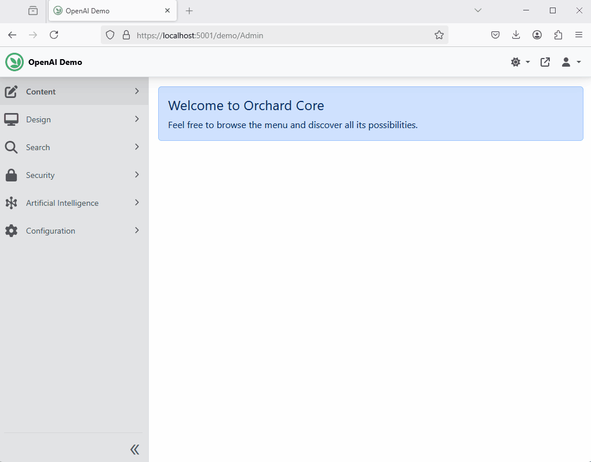

## AI Chat Feature

The **AI Chat** feature builds upon the **AI Services** feature by adding AI chat capabilities. Once enabled, any chat-type AI profile with the "Show On Admin Menu" option will appear under the **Artificial Intelligence** section in the admin menu, allowing you to interact with your chat profiles. If the Widgets feature is enabled, a widget will also be available to add to your content.

**Note**: This feature does not provide completion client implementations (e.g., OpenAI, DeepSeek, etc.). To enable chat capabilities, you must enable at least one feature that implements an AI completion client, such as:

- **OpenAI AI Chat** (`CrestApps.OrchardCore.OpenAI`): AI-powered chat using Azure OpenAI service.
- **Azure OpenAI Chat** (`CrestApps.OrchardCore.OpenAI.Azure.Standard`): AI services using Azure OpenAI models.
- **Azure OpenAI Chat with Your Data** (`CrestApps.OrchardCore.OpenAI.Azure.AISearch`): AI chat using Azure OpenAI models combined with Azure AI Search data.
- **Azure AI Inference Chat** (`CrestApps.OrchardCore.AzureAIInference`): AI services using Azure AI Inference (GitHub models) models.
- **DeepSeek AI Chat** (`CrestApps.OrchardCore.DeepSeek`): AI-powered chat using Azure DeepSeek cloud service.
- **Ollama AI Chat** (`CrestApps.OrchardCore.Ollama`): AI-powered chat using Azure Ollama service.

### Voice Input Support

The AI Chat feature includes support for voice input using microphone recording with real-time speech-to-text transcription. When configured, users can speak their messages instead of typing them.

**Supported Providers:**
- OpenAI (using Whisper models)
- Azure OpenAI (using Whisper deployments)

**Configuration:**

1. **Enable a Speech-to-Text Connection** - Configure a provider connection with `Type` set to `SpeechToText` in your `appsettings.json`:

```json
{
  "OrchardCore": {
    "CrestApps_AI": {
      "Providers": {
        "OpenAI": {
          "Connections": {
            "MyWhisperConnection": {
              "Type": "SpeechToText",
              "DefaultDeploymentName": "whisper-1",
              "Endpoint": "https://api.openai.com/v1",
              "ApiKey": "your-api-key"
            }
          }
        }
      },
      "Chat": {
        "MaxAudioSizeInBytes": 10000000
      }
    }
  }
}
```

2. **Configure AI Profile** - In the admin UI, edit your AI Profile and:
   - Check "Use Microphone" option
   - Select your Speech-to-Text connection from the dropdown

3. **Audio Size Limits** - Configure the maximum audio size in bytes (optional):
   - `MaxAudioSizeInBytes`: Maximum size for audio data (default: 10MB)
   - Set to `null` or negative value for no limit
   - Example: `"MaxAudioSizeInBytes": null` (no limit)
   - Example: `"MaxAudioSizeInBytes": 5000000` (5MB limit)

**How It Works:**
- Audio is recorded in 1-second chunks and transcribed in real-time
- Transcribed text appears progressively in the chat UI as you speak
- When you stop recording, the complete transcription is placed in the input field for review
- You can edit the transcribed text before sending if needed

### Connection Types

When configuring provider connections, you can specify the connection type using the `Type` property:

- **`Chat`** (default) - For chat/completion models
- **`Embedding`** - For embedding models
- **`SpeechToText`** - For speech-to-text models (voice input)

If no `Type` is specified, `Chat` is used as the default.

**Example Configuration with Multiple Connection Types:**

```json
{
  "OrchardCore": {
    "CrestApps_AI": {
      "Providers": {
        "OpenAI": {
          "Connections": {
            "ChatConnection": {
              "Type": "Chat",
              "DefaultDeploymentName": "gpt-4",
              "Endpoint": "https://api.openai.com/v1",
              "ApiKey": "your-api-key"
            },
            "EmbeddingConnection": {
              "Type": "Embedding",
              "DefaultDeploymentName": "text-embedding-3-small",
              "Endpoint": "https://api.openai.com/v1",
              "ApiKey": "your-api-key"
            },
            "WhisperConnection": {
              "Type": "SpeechToText",
              "DefaultDeploymentName": "whisper-1",
              "Endpoint": "https://api.openai.com/v1",
              "ApiKey": "your-api-key"
            }
          }
        }
      }
    }
  }
}
```

### Here is a Screen cast of the Admin Chat User Interface



### Here is a Screen cast of the Frontend Widget Interface


