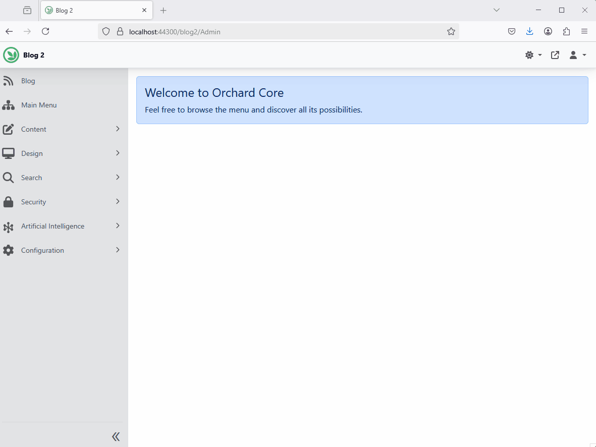

# Model Context Protocol (MCP)

The [Model Context Protocol (MCP)](https://modelcontextprotocol.io/introduction) is an open standard that allows seamless integration between large language model (LLM) applications and external tools or data sources. Whether you're building an AI-enhanced IDE, a chat interface, or custom AI workflows, MCP makes it easy to supply LLMs with the context they need.

---

## Features

### Model Context Protocol (MCP) Client Feature

The **Model Context Protocol (MCP) Client Feature** enables your application to connect to remote MCP servers using standard HTTP requests. One of the supported transport types is **Server-Sent Events (SSE)**, which allows real-time data flow between LLMs and external services.

---

#### 🛠 Connect to a Remote MCP Server (SSE Transport)

To connect your application to a remote MCP server using SSE:

1. Open your Orchard Core project.
2. Navigate to **Artificial Intelligence** → **MCP Connections**.
3. Click the **Add Connection** button.
4. Under the **Server Sent Events (SSE)** source, click **Add**.
5. Enter the following connection details:
   - **Display Text**: `Remote AI Time Server`
   - **Endpoint**: `https://localhost:1234/`
   - **Additional Headers**: Leave empty or supply any required headers.
6. Save the connection.

#### ➕ Create an AI Profile

Now that the connection is added, you can create an AI profile that uses this connection:

👉 [Learn how to create an AI Profile](../CrestApps.OrchardCore.AI/README.md#creating-ai-profiles)

##### 📄 Alternative: Recipe-Based Setup (SSE)

You can also configure the SSE connection programmatically using a recipe:

```json
{
  "steps": [
    {
      "name": "McpConnection",
      "connections": [
        {
          "DisplayText": "Example server",
          "Properties": {
            "SseMcpConnectionMetadata": {
              "Endpoint": "https://localhost:1234/",
              "AdditionalHeaders": {}
            }
          }
        }
      ]
    }
  ]
}
```

---

### Model Context Protocol (Local MCP) Client Feature

The **Local MCP Client Feature** allows your application to connect to MCP servers running locally, typically in containers. It uses **Standard Input/Output (Stdio)** for communication — ideal for offline tools or running local services.

#### 🌐 Example Use Case: Global Time Capabilities with `mcp/time`

Let's equip your AI model with time zone intelligence using the [`mcp/time`](https://hub.docker.com/r/mcp/time) Docker image.

### 🧭 Step-by-Step: Connect to a Local MCP Server (Stdio Transport)

#### Step 1: Install Docker Desktop

Download and install [Docker Desktop](https://www.docker.com/products/docker-desktop), then launch the app.

#### Step 2: Pull the MCP Docker Image

1. Open Docker Desktop.
2. Search for `mcp/time` in the **Docker Hub** tab.
3. Click on the image and hit **Pull**.

#### Step 3: Add the Connection via Orchard Core

1. Open your Orchard Core project.
2. Navigate to **Artificial Intelligence** → **MCP Connections**.
3. Click the **Add Connection** button.
4. Under the **Standard Input/Output (Stdio)** source, click **Add**.
5. Enter the following connection details:
   - **Display Text**: `Global Time Capabilities`
   - **Command**: `docker`
   - **Command Arguments**:
     ```json
     ["run", "-i", "--rm", "mcp/time"]
     ```

💡 These arguments are based on the official usage from the [`mcp/time` Docker Hub page](https://hub.docker.com/r/mcp/time).

#### ➕ Create an AI Profile

Now that the connection is added, you can create an AI profile that uses it:

👉 [Learn how to create an AI Profile](../CrestApps.OrchardCore.AI/README.md#creating-ai-profiles)

##### 📄 Alternative: Recipe-Based Setup (Stdio)

Prefer configuration through code? Here's how to define the same connection using a recipe:

```json
{
  "steps": [
    {
      "name": "McpConnection",
      "connections": [
        {
          "DisplayText": "Global Time Capabilities",
          "Properties": {
            "StdioMcpConnectionMetadata": {
              "Command": "docker",
              "Arguments": [
                "run",
                "-i",
                "--rm",
                "mcp/time"
              ]
            }
          }
        }
      ]
    }
  ]
}
```

---

### Admin Chat UI with Time MCP Server Integration (MCP Demonstration)



---

## 🔍 Explore More MCP Servers

Looking for more MCP-compatible tools? Explore these resources:

- [Docker Hub: MCP Images](https://hub.docker.com/search?q=mcp)
- [MCP.so](https://mcp.so/)
- [Glama.ai MCP Servers](https://glama.ai/mcp/servers)
- [MCPServers.org](https://mcpservers.org/)
